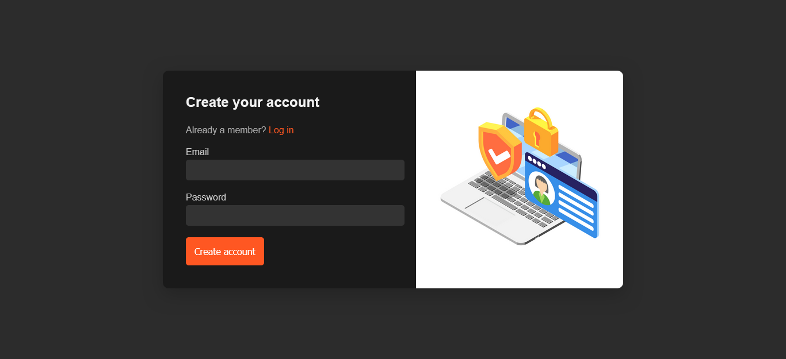
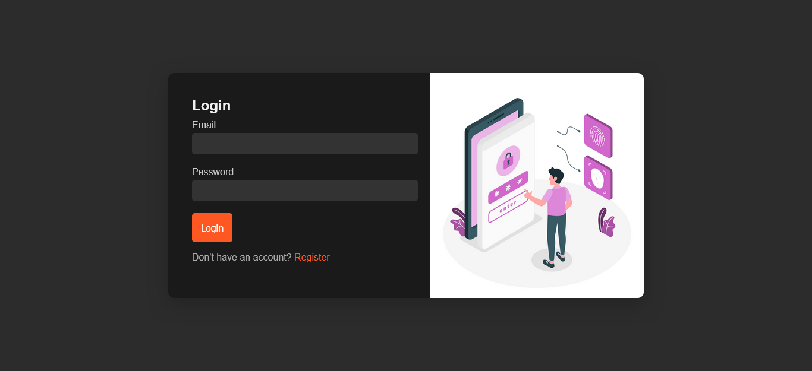
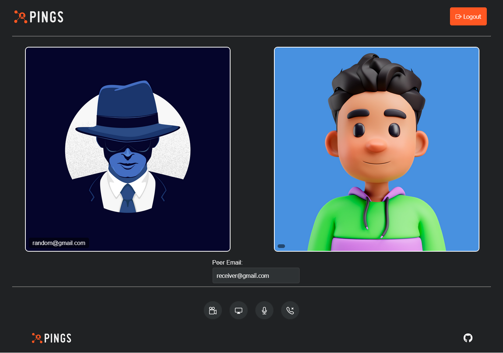

Pings Video Call and Screen Share Application
================

Demo Images:







A WebRTC video audio app made using python Flask, sqlalchemy, dbsqlite,peer.js Framework ,ice STUN/TURN Servers,html,css and js allows communication using emails.

Installation
-------------
To run this on your machine, install the following:
#### Requirements:
* python 3.x
* Flask
* Flask-SocketIO
* Peer.js 
* STUN/TURN Servers

Install requirements using pip:
```
pip install -r requirements.txt
```

To start a server on localhost:
```
python server.py
```
